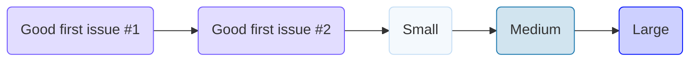

# About the Website Development Team

## Team Levels

The Hack for LA Website Development Team is a **Level 1 Team**. This means we have a support system to help all new developers learn the basics. When you join, you'll start at Level 1 and go through a learning process. The goal is to get you familiar with how we do things. Once you've learned enough and are doing well, you can move on to a Level 2 team for more advanced work.

## Technologies Used

Our tech stack consists of both front-end and back-end technologies:

- **Front-end**: Our front-end is built using the following languages and libraries:
    - HTML
    - SCSS
    - JavaScript
  
- **Back-end and DevOps**: For back-end and development operations, we rely on:
    - GitHub Actions
    - Google Apps Script

## Developer Expectations

When you join the Hack for LA Website Development Team, there are certain expectations:

### Time Commitment

- **Weekly Hours**: A minimum of 6 hours per week is required, not including vacations or weeks off.

### Communication

- **Time Off**: If you plan to take a week off or go on a longer vacation, notify the tech leadership team. This can be done through a Slack message in the `hfla-site` channel and an @ mention in the comment section of the issue you're working on.

### Meetings

- **Mandatory**: Attend at least one of the following meetings each week:
    - All team weekly meeting (UX/UR, Development, Product) — Sundays 10am-12 noon Pacific Time.
    - Developer (front-end/back-end) weekly team meeting — Tuesdays 7-8 pm Pacific Time.
    - Developer Office Hours meeting — Thursdays 7-8 pm Pacific Time.

### Issue Handling

- Work on one issue at a time.
- Wait until your pull request is merged before working on another issue.

### Skill Progression

Start with issues of increasing complexity in the following order:

!!! note "Exceptions to these expectations can be discussed with the tech leadership team on a case-by-case basis."
